# 📌Практическая работа (экзамен)
## 🔹Задание 1: Работа с Yandex DataTransfer
### Требуется перенести данные из Managed Service for YDB в объектное хранилище Object Storage. Выполнить необходимо с использованием сервиса Data Transfer.
1) Создаём бакет 
 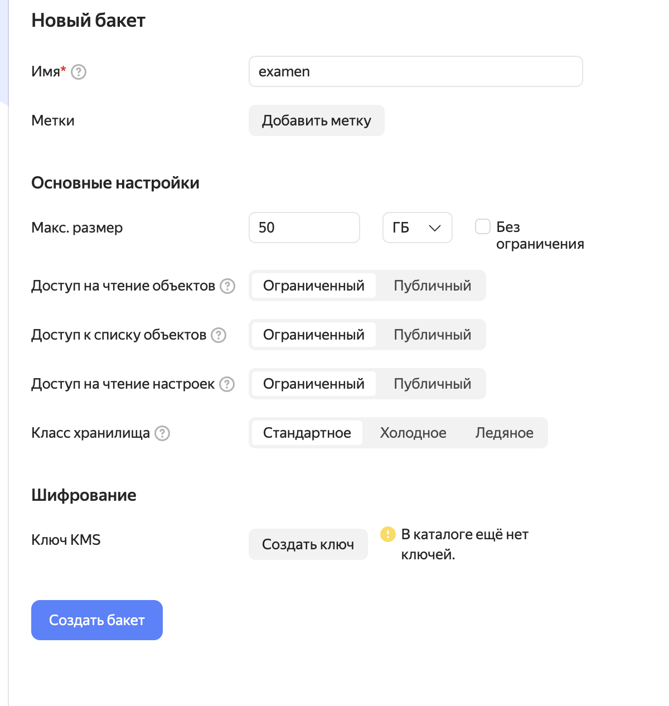
2) Создаём базу данных YDB

3) В YDB создаём таблицу (в моём случае таблица со списком моей семьи)
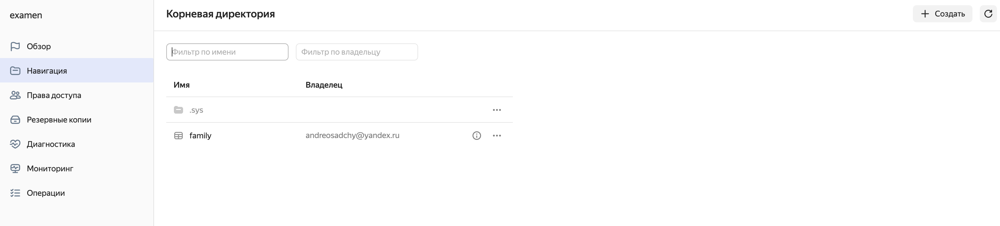
4) Добавляем строки согласно инструкции
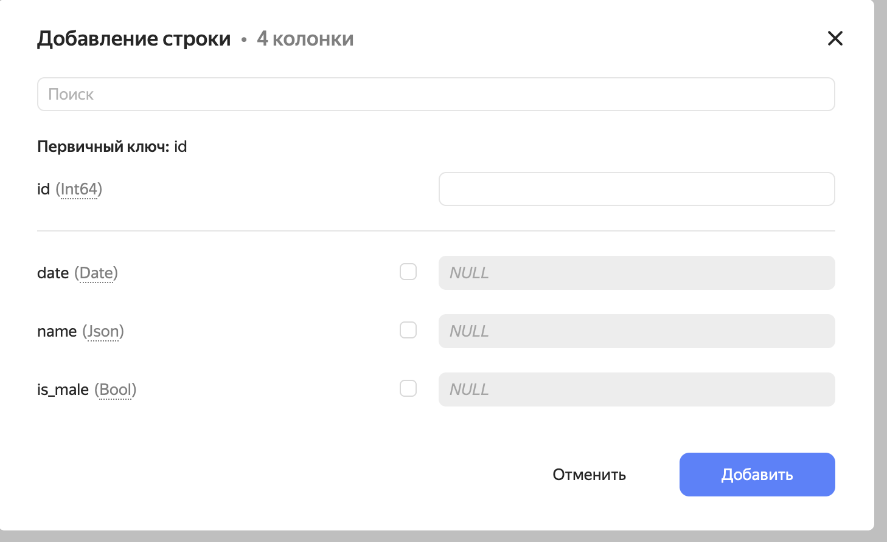
5) Получилась такая таблица
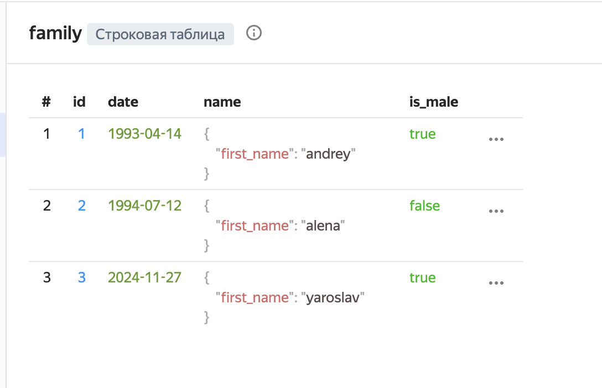
6)  Создаём эндпоинты (приёмник и источник) и запускаем трансфер
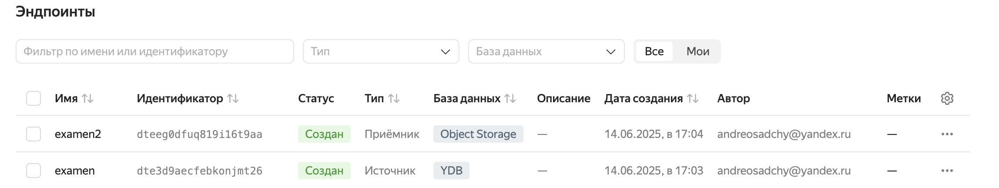
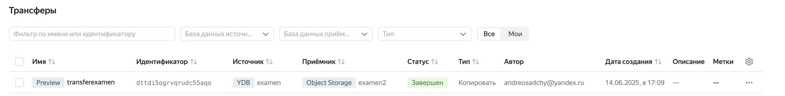
7)  Проверяем как прошел трансфер, заходим в ранее созданный нами бакет
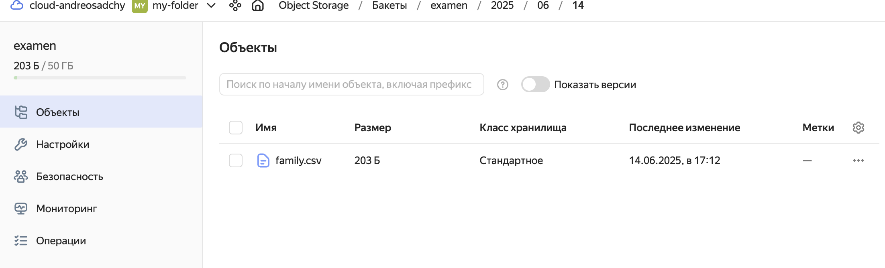
8)  Скачиваем файл, смотрим его содержимое.
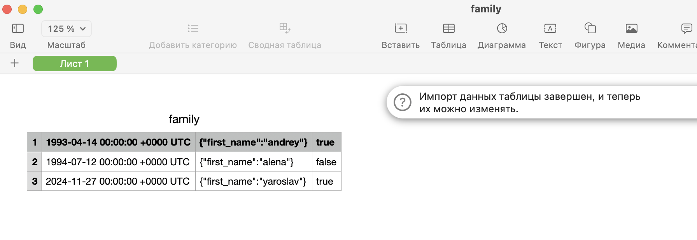
Всё как надо. Конечный файл лежит [тут](https://github.com/andrey-osadchiy/etl_processes/tree/main/final_project/staff)

## 🔹Задание 2: Автоматизация работы с Yandex Data Processing при помощи Apache AirFlow
### Требуется обрабатывать файлы (parquet или CSV) из внешнего источника. Размер входящих файлов меняется в различные дни месяца.  
Сначaла в ранее созданном бакете подготавливаем все необходимые папки. В папке dags будет лежать даг, в scripts наш скрипт. В папке файл наш файл со списком семьи из прошлого задания. В results мы засунем новый файл.
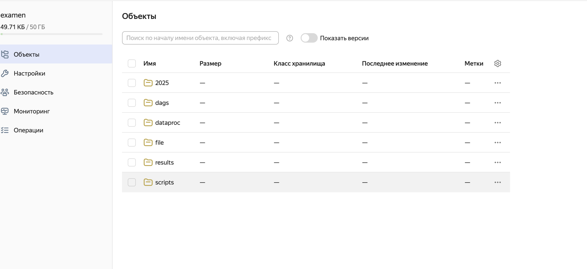
Далее мы создаём кластеры. Кластер AirFlow, который будет аркестраротом (планирование и запуск) и Кластер Data Proc (непосредственное выполнение PySpark-заданий)

Сначла Data Proc

Потом AirFlow
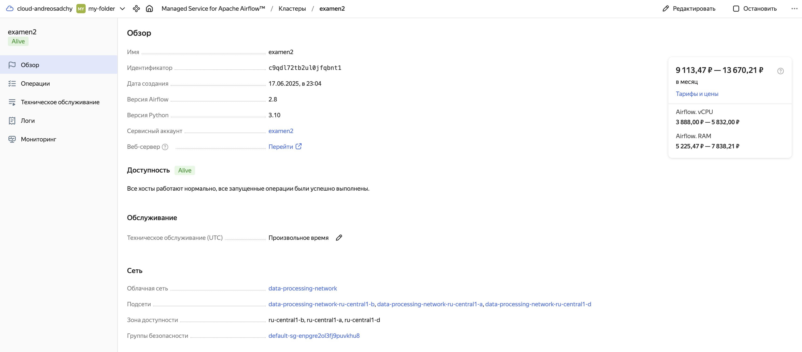
Далее готовим файлы data_processing_dag.py 
```python

from airflow import DAG
from airflow.providers.yandex.operators.yandexcloud_dataproc import DataprocCreatePysparkJobOperator
from datetime import datetime

YC_DP_CLUSTER_ID = 'c9quhbgni0nl9loms74k'
YC_BUCKET = 'examen'

with DAG(
    'family_data_processing_v3',
    schedule_interval='@daily',
    start_date=datetime(2025, 6, 1),
    catchup=False,
    tags=['data-processing']
) as dag:

    process_data = DataprocCreatePysparkJobOperator(
        task_id='process_data',
        cluster_id=YC_DP_CLUSTER_ID,
        main_python_file_uri=f's3a://{YC_BUCKET}/scripts/process_data.py',
        args=[
            '--input', f's3a://{YC_BUCKET}/file/family.csv',
            '--output', f's3a://{YC_BUCKET}/results/{datetime.now().strftime("%Y%m%d_%H%M%S")}'
        ],
        properties={
            'spark.sql.legacy.timeParserPolicy': 'LEGACY',  # Для совместимости формата даты
            'spark.driver.memory': '2g'
        }
    )
```
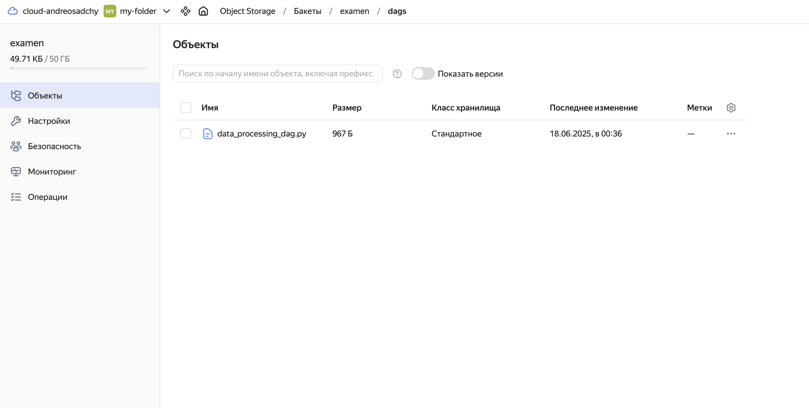

и process_data.py
```python
from pyspark.sql import SparkSession
from pyspark.sql.functions import col, year, to_date
import sys

def main():
    spark = SparkSession.builder \
        .appName("FamilyDataProcessing") \
        .config("spark.hadoop.fs.s3a.endpoint", "storage.yandexcloud.net") \
        .getOrCreate()

    try:
        args = {k: v for k, v in zip(sys.argv[1::2], sys.argv[2::2])}
        input_path = args.get('--input', 's3://examen/file/family.csv')
        output_path = args.get('--output', 's3://examen/results/family_processed')
  
        df = spark.read.csv(input_path, header=False, schema="id INT, date STRING, name STRING, is_male BOOLEAN")
        
        # Преобразование даты (формат: "1993-04-14 00:00:00 +0000 UTC")
        df = df.withColumn("date", to_date(col("date").substr(1, 10), "yyyy-MM-dd"))
        
        # Проверка данных
        print("Пример данных:")
        df.show(5, truncate=False)
        
        # Фильтрация и агрегация
        result_df = df.filter(year(col("date")) >= 2001) \
                    .groupBy("is_male") \
                    .count()
        
        # Сохранение
        result_df.write.mode("overwrite").parquet(output_path)
        print(f"Результат сохранен в {output_path}")
        return 0

    except Exception as e:
        print(f"Ошибка: {str(e)}", file=sys.stderr)
        return 1
    finally:
        spark.stop()

if __name__ == "__main__":
    sys.exit(main())
```

Файлы можно посмотреть [тут](https://github.com/andrey-osadchiy/etl_processes/tree/main/final_project/staff)

Далее подключаемся к airflow по ранее нами созданным реквизитам
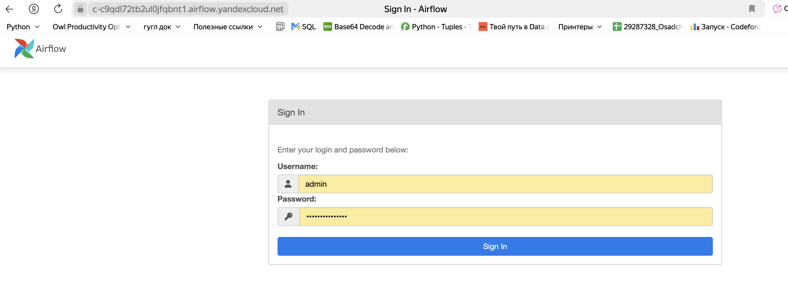

Запускаем наш даг
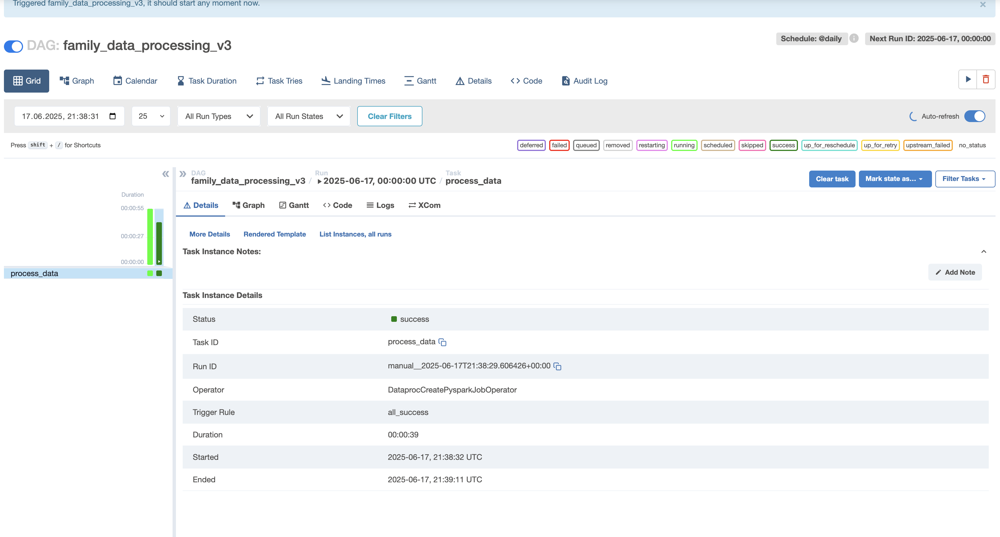
Всё успешно, проверяем папку с результатами:
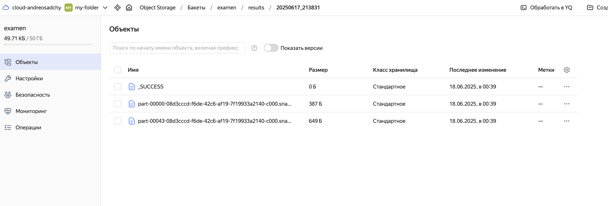
Отлично. Всё получилось. Осталось только удалить кластеры
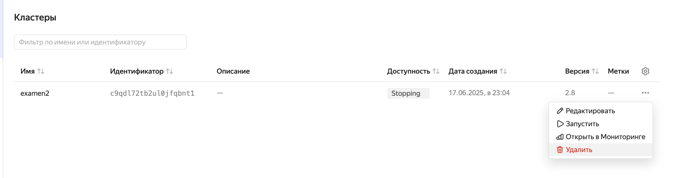


## 🔹Задание 4 (дополнительное): Визуализация в DataLens
### С помощью Yandex DataLens построить дашборды для визуализации загруженных данных. 
