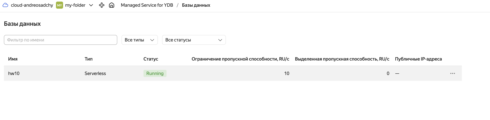
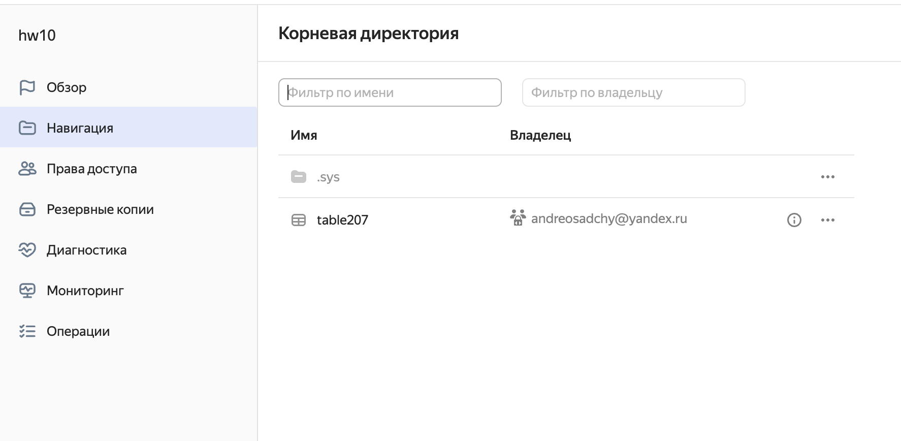
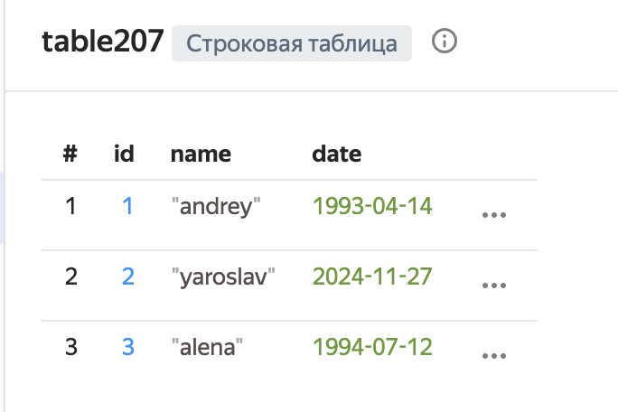
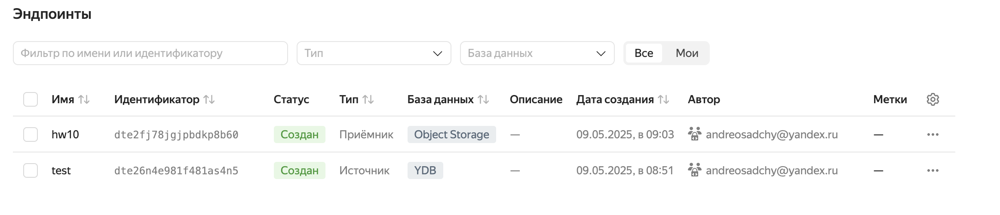
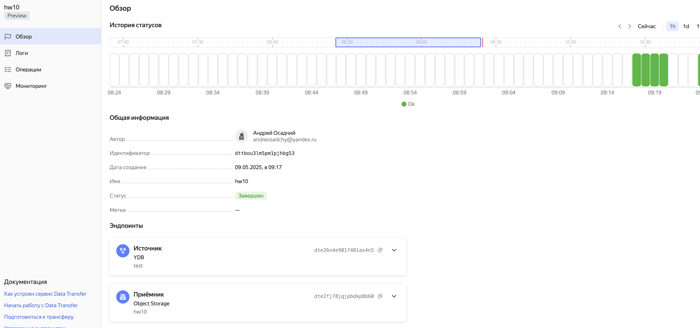
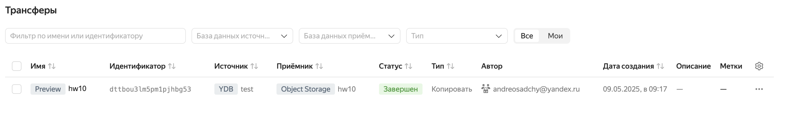
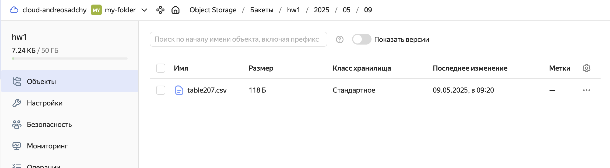

# Тема 10. Хранение данных в облаке
## Практическая работа
1. Создайте кластер-источник Managed Service for PostgreSQL 
2. Создайте эндпоинт-приемник типа Object Storage
3. Подготовьте и запустите трансфер
4. Проверьте работу копирования при повторной активации

Создаём кластер Managed Service и там создаём бд
 

Создаём там таблицу и заполняем её тестовыми данными
 
 

 Создаём эндпоинты (один на строне бд другой object storage)
 
 
 Создаём Data transfer
 
 

 
 Проверяем записалось ли в object storage 

 
