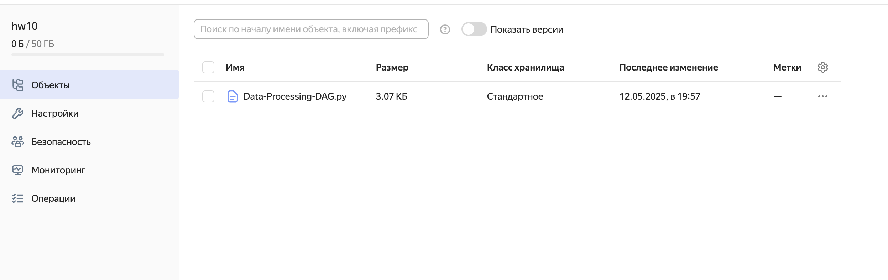
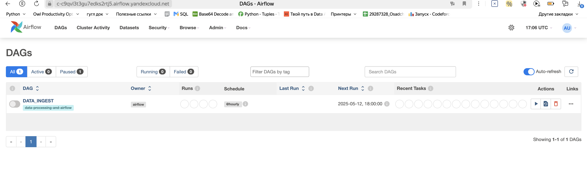
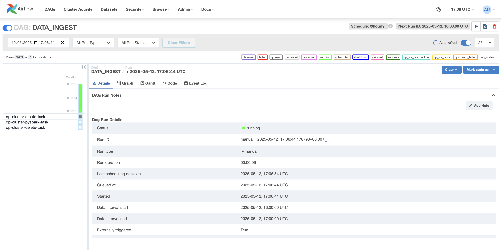

# Тема 11. Работа с облачными вычислениями
## Практическая работа
### Описание задания
Повторите работу из демонстрации вебинара «Работа с облачными вычислениями».
Обработайте данные из Yandex Object Storage с помощью сервиса Yandex Apache AirFlow, используя мощности Yandex Data Processing.

Создаём необходимые папки в бакете и кладём туда два файла согласно инструкции 
 
 

 Далее создаём сеть и настраиваем подсети, предварительно создав nat-шлюз и настроив таблицы маршрутизации

 Далее создаём кластер Metastore

 Создаём и запускаем кластер через Yandex Managed Service for Apache Airflow
 

Залогиниваемся в Apache Airflow под реквизтами указанными нами во время настройки кластера
 
Запускаем Dag
 

Выключаем кластер
 
