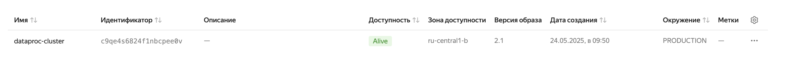
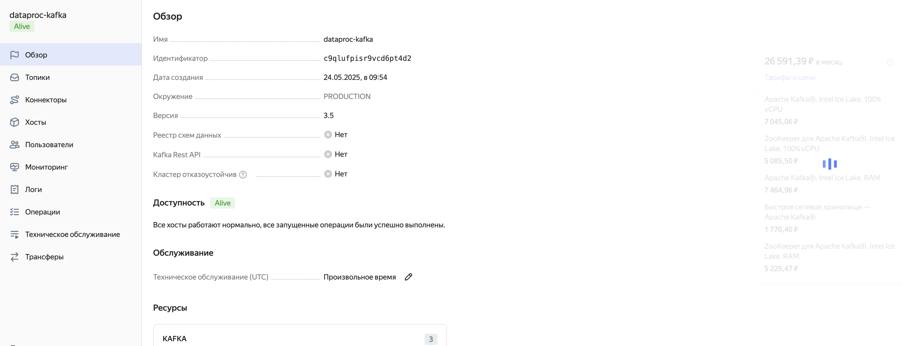
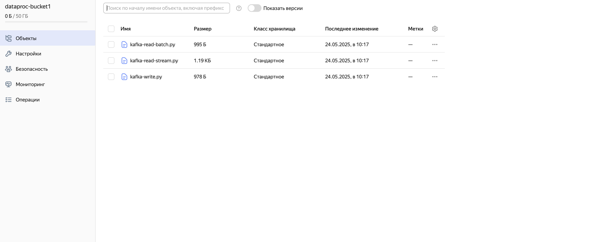
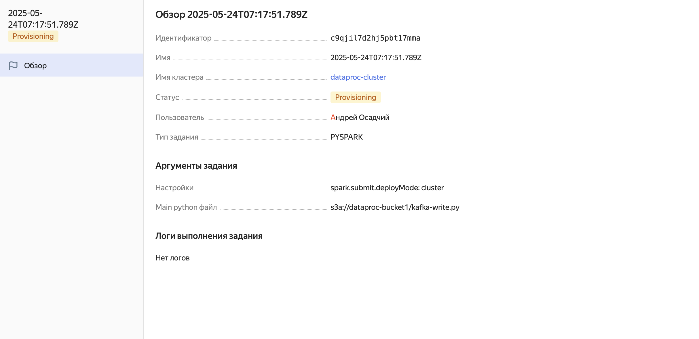
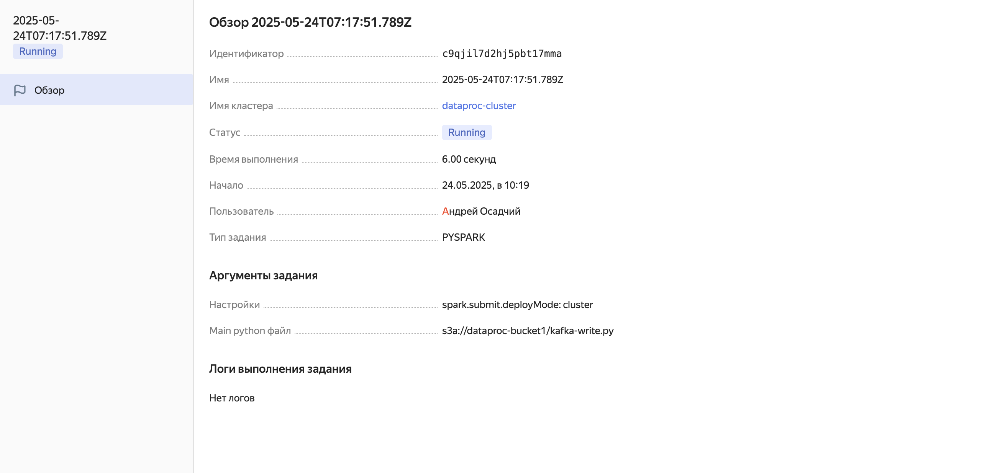
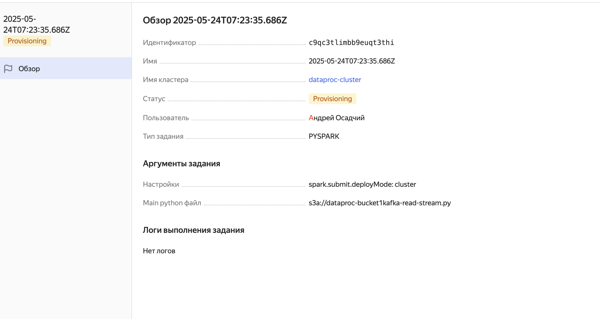
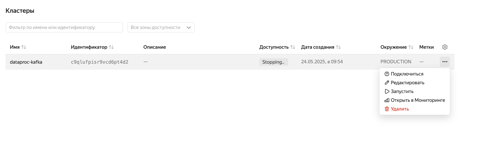
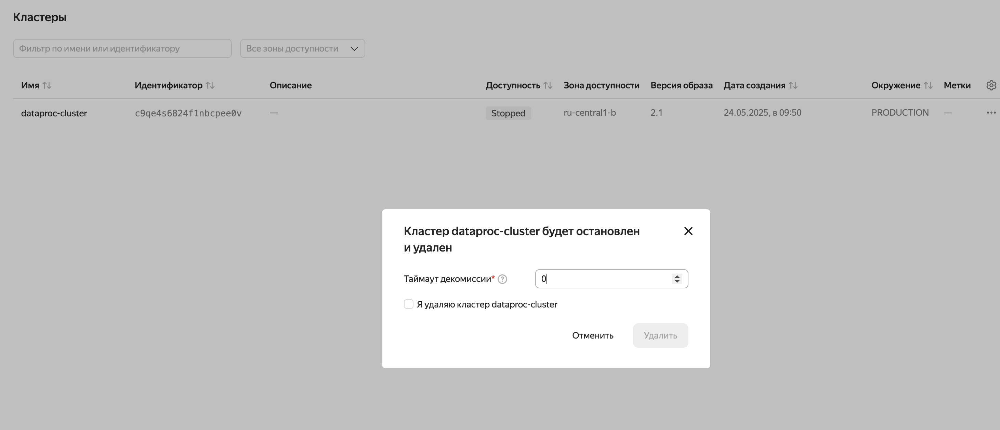
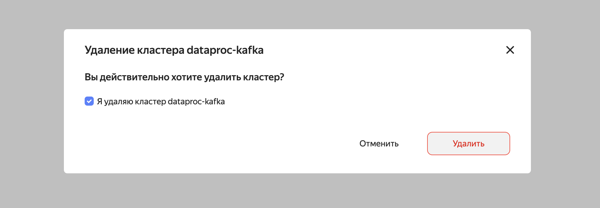

# Тема 13. Потоковая обработка данных
## Научиться использовать Apache Kafka с помощью PySpark-заданий
Повторите работу из демонстрации вебинара «Потоковая обработка данных».
Запишите сообщения в топик Apache Kafka® и прочитайте сообщения из топика с помощью PySpark-задания.

Разворачиваем кластер Yandex Data Processing при помощи Yandex Cloud
   
Аналогично после танцев с бубнами разворачиваем такой же сервис только для kafka
   
   Добавлявем необходмые файлы в специально созданный бакет
   
   Создаём первое задание
  
  Вроде запустилось
  
 Создаём второе задание
   
  Удалаяем все наши кластеры ибо едят много денег
  
  
  
