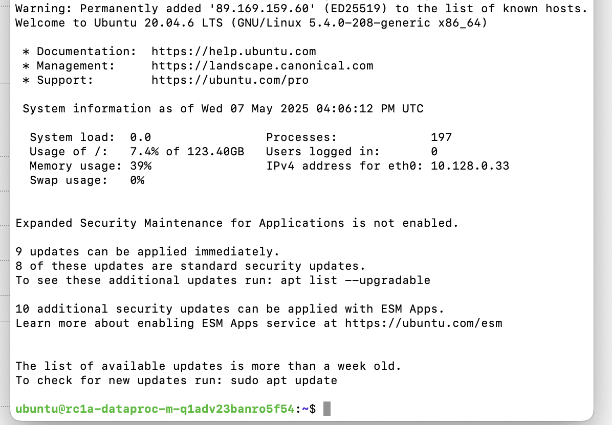
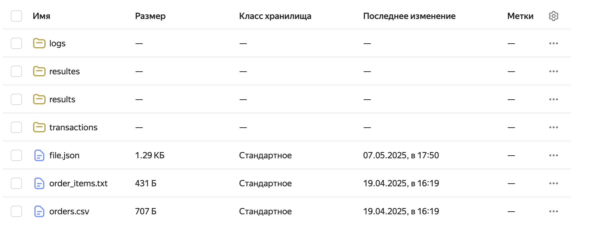
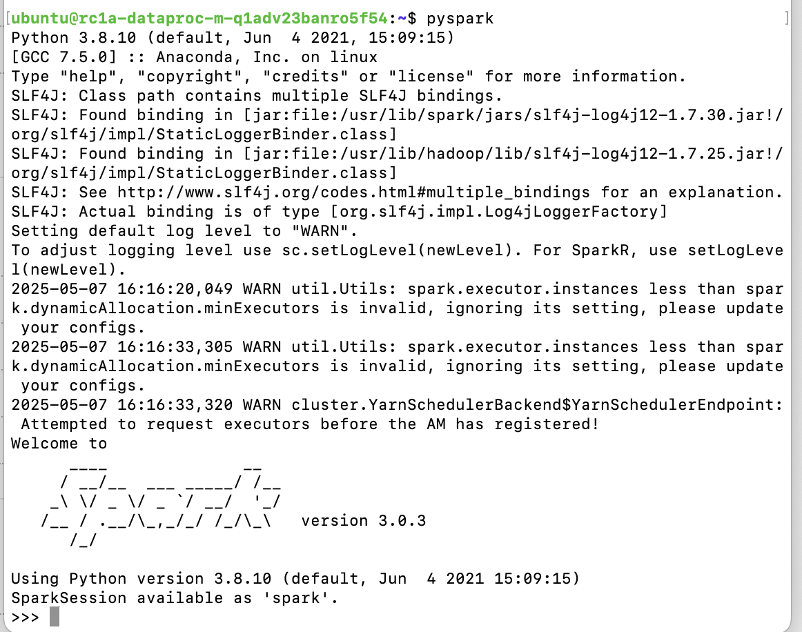
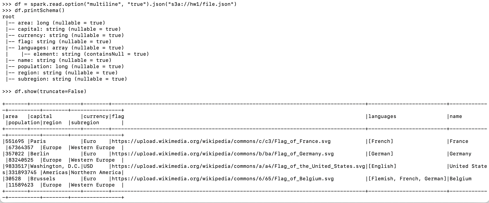
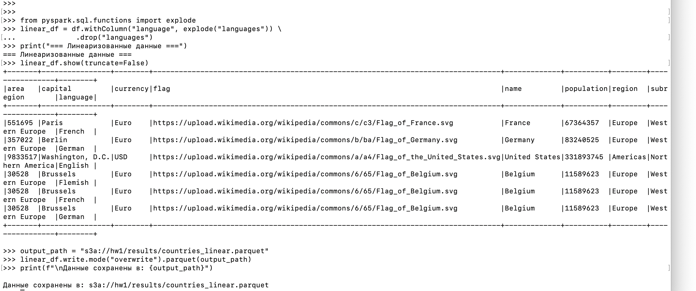
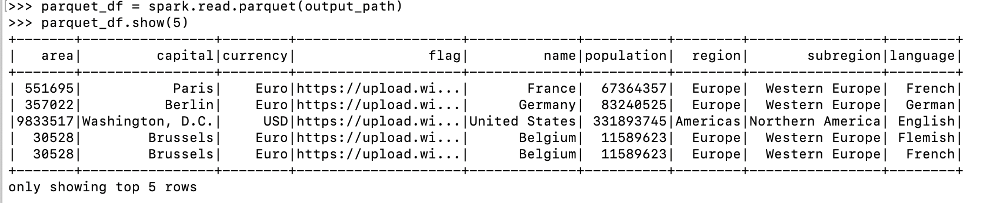
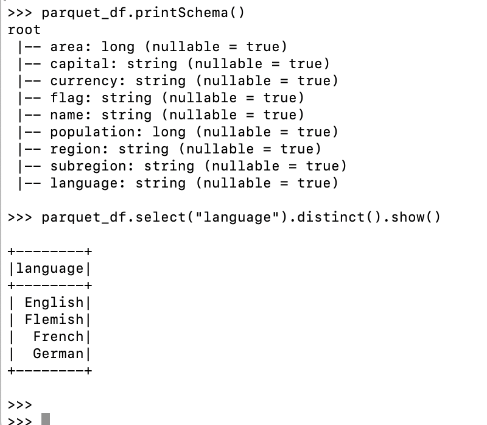

# Тема 9. Работа с Big Data и NoSQL
## Практика работы с Hadoop и Spark в облаке
Повторить работу из демонстрации вебинара «Работа с Big Data и NoSQL».
1. Развернуть кластер Hadoop и Spark с помощью Yandex Data Processing
2. Загрузить данные для обработки
3. Провести трансформацию и запись в Yandex Data Processing

  ## Задание 1
  Разворачиваем кластер при помощи Yandex Cloud
 

  ## Задание 2
  Загрузим данные для обработки в бакет, наш файл называется file.json
   
  
  ## Задание 3
  Сначала запустим спарк
  
  
  Далее прочитаем наш файл из бакета
 
 
  Приведём данные к линейному виду и запишем их в наш бакет  
 
 
  Прочитаем наш записанный в бакет файл
 
 

  Все записалось, отлично, выходим из спарка
 
  

